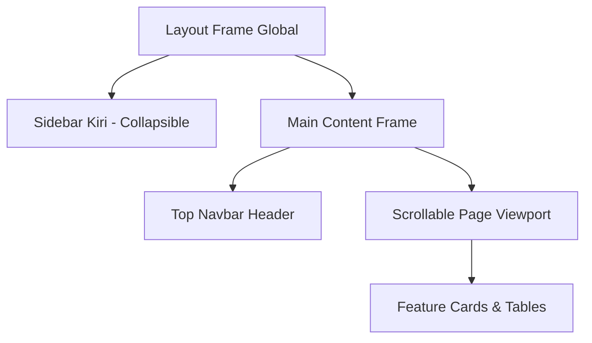

# 🎨 PANDUAN SISTEM DESAIN & ATURAN PENGEMBANGAN FRONT END (SIAKAD BKU)

Dokumen ini adalah acuan resmi bagi tim Front End untuk menyelaraskan seluruh tampilan halaman (*design system alignment*) di dalam web React frontend SIAKAD BKU. Tujuannya adalah memastikan seluruh modul pengguna memiliki estetika premium, harmonis, konsisten, dan responsif.

---

## 📌 1. Filosofi & Arah Desain
Desain SIAKAD BKU mengusung konsep **"Academic Premium & Glassmorphism"**. Konsep ini menggabungkan warna biru formal instansi dengan elemen antarmuka yang transparan, modern, bersih, dan berjiwa dinamis guna menciptakan kesan profesional sekaligus mutakhir (*state-of-the-art*).

---

## 🎨 2. Palet Warna (Color System)
Kita secara ketat menggunakan warna-warna BKU yang didefinisikan dalam variabel Tailwind CSS v4 di `index.css`:

| Kategori Warna | Kelas Tailwind | Kode HEX | Peruntukan Utama |
| :--- | :--- | :--- | :--- |
| **Primary** | `bg-bku-primary` | `#00236f` | Warna dominan, Sidebar active, Tombol Utama, Header |
| **Hover State** | `bg-bku-hover` | `#001a52` | Efek hover pada elemen primary |
| **Accent Light** | `bg-bku-light` | `#fed7aa` | Highlight oranye lembut, Border aktif |
| **Extra Light** | `bg-bku-xlight` | `#f8faff` | Latar belakang tabel, kartu sekunder |
| **Success** | `text-bku-success` | `#16a34a` | Status "Disetujui", "Aktif", "Lulus" |
| **Warning** | `text-bku-warning` | `#d97706` | Status "Review", "Pending", "Cuti" |
| **Danger** | `text-bku-danger` | `#dc2626` | Status "Ditolak", "Non-Aktif", "Kritis" |
| **Info** | `text-bku-info` | `#2563eb` | Informasi, Notifikasi, Tautan |

### Latar Belakang Layar Global (Global Background)
Semua halaman dibungkus dengan latar belakang warna netral yang memiliki semburan gradasi radial biru lembut untuk menghilangkan kesan flat:
```html
<body class="bg-slate-50 bg-[radial-gradient(at_0%_0%,rgba(0,35,111,0.08)_0px,transparent_50%),radial-gradient(at_100%_100%,rgba(59,130,246,0.05)_0px,transparent_50%)]">
```

---

## ✍️ 3. Tipografi & Hierarki Font
Kita menggunakan dua Google Fonts premium untuk membedakan struktur judul dan isi data:

1. **Plus Jakarta Sans** (`font-jakarta` / `font-headline`) — Digunakan eksklusif untuk elemen judul, nama navigasi, header card, dan angka besar.
2. **Inter** (`font-inter`) — Digunakan untuk teks deskriptif, tabel data, label formulir, tombol, dan paragraf panjang demi keterbacaan yang optimal.

### Penerapan Skala Teks:
* **Judul Utama Halaman**: `text-2xl md:text-3xl font-bold tracking-tight text-slate-800 font-headline`
* **Sub-Judul / Judul Kartu**: `text-sm md:text-base font-bold text-slate-700 uppercase tracking-wider font-headline`
* **Teks Data Utama**: `text-xs md:text-sm font-medium text-slate-600 font-inter`
* **Label Formulir**: `text-[10px] md:text-xs font-bold text-slate-400 uppercase tracking-widest font-headline`
* **Keterangan Lemah**: `text-[9px] md:text-xs text-slate-400 font-inter`

---

## 🪟 4. Spesifikasi Kartu Glassmorphism (Glassmorphism)
Elemen utama pembungkus konten di dashboard adalah `.glass-card`. Komponen ini harus transparan namun tetap kokoh memisahkan konten dari latar belakang.

```css
/* Utilitas CSS di index.css */
@utility glass-card {
    background: rgba(255, 255, 255, 0.75);
    backdrop-filter: blur(16px);
    -webkit-backdrop-filter: blur(16px);
    border: 1px solid rgba(255, 255, 255, 0.5);
    box-shadow: 0 4px 30px rgba(0, 35, 111, 0.03);
}
```
* **Radius Border**: Selalu gunakan `rounded-2xl` (`16px`) pada kontainer `.glass-card` agar senada dengan lengkungan prototipe mockup.

---

## 🔳 5. Standardisasi Komponen UI Reusable
Semua halaman wajib merujuk pada standar komponen berikut demi menjaga keselarasan:

### A. Desain Tombol (Buttons)
```jsx
// Tombol Utama (Primary)
<button class="px-4 py-2.5 bg-bku-primary hover:bg-bku-hover text-white text-xs font-semibold rounded-xl transition-all duration-200 hover:scale-[1.02] active:scale-[0.98] shadow-md shadow-bku-primary/5">
  Simpan Data
</button>

// Tombol Sekunder (Secondary Glass)
<button class="px-4 py-2.5 bg-white/50 hover:bg-slate-100 border border-slate-200 text-slate-600 text-xs font-semibold rounded-xl transition-all duration-200">
  Batal
</button>
```

### B. Input & Select Formulir
* Menggunakan border radius `rounded-xl` (12px) dengan transition ring yang halus:
```jsx
<input 
  type="text" 
  class="w-full px-3 py-2 bg-slate-50/70 border border-slate-200 rounded-xl text-xs focus:ring-2 focus:ring-bku-primary/20 focus:border-bku-primary outline-none transition-all duration-200" 
/>
```

### C. Tabel Data & Panel Filter
Tabel diletakkan di dalam kontainer `.glass-card` dengan header abu-abu tipis dan hover highlight baris berwarna biru BKU super transparan:
* **Table Wrapper**: `<div class="glass-card rounded-2xl overflow-hidden border border-slate-200/60 flex flex-col">`
* **Table Header**: `<thead class="bg-slate-50/50">`
* **Table Row Hover**: `<tr class="hover:bg-bku-primary/5 transition-colors duration-150 border-b border-slate-100">`
* **Zebra Shading**: Baris genap menggunakan kelas `bg-slate-50/20` untuk membantu keterbacaan data yang padat.

---

## 🏛️ 6. Arsitektur Layout Seragam untuk 5 Role
Struktur tata letak luar (*frame layout*) untuk seluruh role harus mengikuti diagram relasi berikut:



### Kode Kerangka Layout Utama (React JSX):
```jsx
import React from 'react';
import Sidebar from './Sidebar';
import Header from './Header';

const MainLayout = ({ children }) => {
  return (
    <div className="flex h-screen w-screen overflow-hidden bg-slate-50 bg-[radial-gradient(at_0%_0%,rgba(0,35,111,0.08)_0px,transparent_50%)]">
      {/* 1. Sidebar Kiri (Glassmorphism dark gradient BKU) */}
      <Sidebar />
      
      {/* 2. Frame Konten Utama */}
      <main className="flex-1 flex flex-col h-full overflow-hidden">
        {/* Top Navbar Header */}
        <Header />
        
        {/* Viewport Konten Utama (Scrollable dengan padding standar p-6) */}
        <div className="flex-1 overflow-y-auto p-6 space-y-6">
          {children}
        </div>
      </main>
    </div>
  );
};

export default MainLayout;
```

---

## 📋 7. Daftar Periksa (Checklist) Harmonisasi 5 Role

Gunakan daftar periksa berikut saat melakukan revisi dan sinkronisasi tampilan pada masing-masing modul:

### [ ] Modul 1: Super Admin Portal
* [ ] Mengubah dashboard Super Admin menggunakan filter periode akademik global yang mendukung data *drill-down*.
* [ ] Mengubah manajemen RBAC menjadi antarmuka tabel ceklis CRUD yang interaktif.
* [ ] Memasang dashboard gamifikasi keaktifan Ormawa (*leaderboard* bintang keaktifan).

### [ ] Modul 2: Admin Fakultas Portal
* [ ] Mengubah teks seluruh instrumen "Unit Akademik" menjadi "Program Studi".
* [ ] Menghapus modul PMB (Calon Mahasiswa Baru) dan widget Tren Penerimaan Baru.
* [ ] Mengubah nama modul "Data Psikolog" menjadi "Data Konseling" dan menampilkan grafik tren konseling prodi.
* [ ] Mengubah nama modul "Monitor PKKMB" menjadi "Monitor Kencana".

### [ ] Modul 3: Student Hub Portal (Mahasiswa)
* [ ] Membagi halaman Kencana menjadi 4 kategori Tab utama (Pra-Kencana, Kencana, Kencana Fakultas, Pasca Kencana).
* [ ] Mengintegrasikan UI Tugas & Kuis seperti Edlink lengkap dengan batasan waktu, passing grade kelulusan 75, dan unduh sertifikat.
* [ ] Memasang alur antrean konseling (Form pendaftaran, pemilihan tanggal, pilihan Kategori, dan tiket antrean digital).

### [ ] Modul 4: Ormawa Admin Portal
* [ ] Mengganti label "Saldo Kas" menjadi "Pagu".
* [ ] Memasang *Proposal Lock System* (jika ada LPJ kegiatan sebelumnya yang belum diunggah, tombol buat proposal baru otomatis dinonaktifkan).
* [ ] Memasang card leaderboard kepatuhan LPJ (gamifikasi LPJ).

### [ ] Modul 5: Psikolog Portal
* [ ] Menyediakan form filter rekam medis mahasiswa dan ekspor PDF/Excel.
* [ ] Menyesuaikan dokumen rekam medis cetak menggunakan Kop Surat Resmi BKU.
* [ ] Memasang visualisasi grafik tren kesehatan mental (prodi teratas, rasio masalah akademik vs non-akademik).
