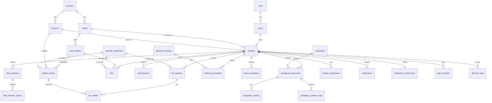

# Student Schema Relasi (Analisis + Usulan)

Dokumen ini fokus pada domain Mahasiswa/Student dan disusun dari kondisi aktual project.

## 1) Kondisi Saat Ini (As-Is)

- `backend/database/migrations/01_ormawa_schema.sql`:
  - berisi schema Ormawa yang sangat lengkap, berbasis UUID, dan menggunakan namespace `ormawa`.
- `backend/database/migrations/02_admin_fakultas_schema.sql`:
  - kosong (belum terisi).
- Runtime backend saat ini **tidak memakai SQL migration folder** sebagai source utama.
  - yang dipakai saat boot: `config.ConnectDB()` -> `migrateModels()` -> `AutoMigrate` dari `backend/models/models.go`.

## 2) Gap Utama yang Ditemukan

1. **Dua jalur skema berbeda**
   - SQL migration Ormawa pakai UUID + `ormawa.*`,
   - AutoMigrate GORM pakai integer (`uint`) di `public`.

2. **Konvensi penamaan belum seragam**
   - contoh: `faculty_id` vs `fakultas_id`, `prodi_id` vs `major_id`, status campur (`aktif`, `Menunggu`, `diproses`, dll).

3. **Relasi student lintas modul sudah ada, tetapi belum dipetakan terpusat**
   - menyulitkan onboarding dan maintenance query lintas fitur.

## 3) Skema Relasi Mahasiswa (Target Konseptual)

Gunakan `students` sebagai aggregate root domain mahasiswa.

### 3.1 Entitas Master

- `roles`
- `users` -> FK `role_id`
- `faculties`
- `majors` -> FK `faculty_id`
- `lecturers` -> FK `user_id`, `faculty_id`
- `students` -> FK `user_id`, `major_id`, optional `dpa_lecturer_id`

### 3.2 Entitas Akademik Inti

- `periode_akademiks`
- `mata_kuliahs` -> FK `major_id`
- `jadwal_kuliahs` -> FK `mata_kuliah_id`, `lecturer_id`, `periode_id`
- `khs` -> FK `student_id`, `mata_kuliah_id`, `periode_id`
- `krs_headers` -> FK `student_id`, `periode_id`
- `krs_details` -> FK `krs_header_id`, `jadwal_kuliah_id`

### 3.3 Entitas Layanan Mahasiswa

- KENCANA: `kencana_tahaps`, `kencana_materis`, `kencana_kuis`, `kuis_soals`, `kencana_hasil_kuis`, `kencana_progresses`, `kencana_bandings`, `kencana_sertifikats`
- Achievement: `achievements`
- Beasiswa: `beasiswas`, `pengajuan_beasiswas`, `pengajuan_berkas`, `pengajuan_pipeline_logs`
- Counseling: `jadwal_konselings`, `booking_konselings`
- Health: `hasil_kesehatans`
- Student Voice: `tiket_aspirasis`, `tiket_timeline_events`
- Organisasi: `riwayat_organisasis`
- Komunikasi: `notifications`, `notification_preferences`, `login_histories`, `aktivitas_logs`, `pengumumans`, `kegiatan_kampuses`

## 4) ERD Ringkas Mahasiswa

## 5) Konvensi Relasi yang Disarankan (Agar Mudah Maintenance)

1. **FK konsisten**: gunakan satu gaya, misal `snake_case` dengan suffix `_id`.
2. **Status enum konsisten** per modul (disarankan lowercase snake_case).
3. **Index minimum**:
   - semua FK (`student_id`, `periode_id`, `jadwal_id`, dll)
   - kolom pencarian (`nim`, `nomor_tiket`, `nomor_referensi`)
   - kolom list/riwayat (`created_at`, `status`)
4. **Unique constraint penting**:
   - `students.user_id`, `students.nim`
   - `tiket_aspirasis.nomor_tiket`
   - `pengajuan_beasiswas.nomor_referensi`
   - `notification_preferences.student_id`
5. **On delete policy**:
   - child detail/log gunakan cascade seperlunya (`krs_details`, `tiket_timeline_events`, `pengajuan_berkas`)
   - master identity (`students`, `users`) hindari delete hard; gunakan `is_active`/soft-delete.

## 6) Relasi Prioritas untuk Developer Mahasiswa

Saat mengerjakan fitur student, biasanya relasi ini yang paling sering dipakai:

- Profil: `students -> users`, `students -> majors -> faculties`
- Dashboard: `students -> aktivitas_logs`, `notifications`, `pengumumans`, `kegiatan_kampuses`
- KRS: `students -> krs_headers -> krs_details -> jadwal_kuliahs -> mata_kuliahs`
- Beasiswa: `students -> pengajuan_beasiswas -> pengajuan_berkas/pipeline_logs -> beasiswas`
- Voice: `students -> tiket_aspirasis -> tiket_timeline_events`

## 7) Catatan Implementasi

- Dokumen ini adalah skema relasi konseptual untuk domain Mahasiswa.
- Untuk kondisi kode saat ini, source of truth tetap di `backend/models/models.go` + `AutoMigrate`.
- Jika nanti ingin full SQL migration versioned, sebaiknya pilih satu strategi tunggal:
  - **A. Full GORM migration**, atau
  - **B. Full SQL migration** (disarankan goose/atlas/flyway), jangan campur tanpa governance.
