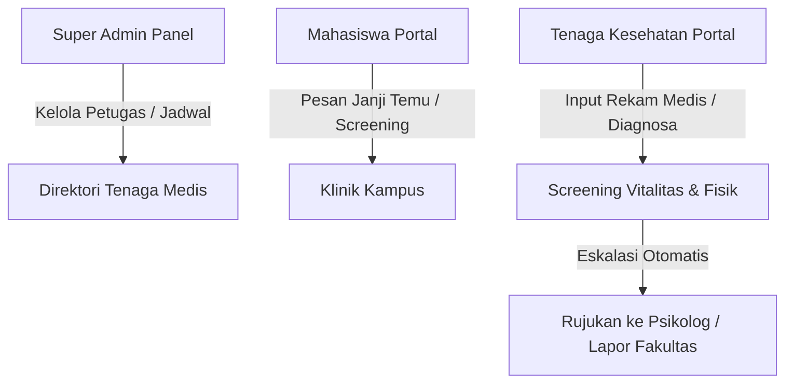

# Laporan Implementasi Modul Tenaga Kesehatan (Medis) BKU

Dokumen ini merangkum seluruh pekerjaan, fitur, dan penyesuaian yang telah berhasil diimplementasikan untuk mendukung **Modul Tenaga Kesehatan BKU** (spesifikasi v1.3). Implementasi mencakup sisi Backend (Go API), Frontend Web (React), serta integrasi panel manajemen Super Admin.

---

## 🛠️ Ringkasan Pekerjaan Selesai

### 1. 🗄️ Backend API & Skema Database (Go)
* **Skema Data GORM**:
  * `TenagaKesehatan`: Profil petugas medis (Spesialisasi, Lokasi, Status Keaktifan).
  * `JadwalKesehatan`: Slot janji temu (Tanggal, Waktu Mulai/Selesai, Kuota, Lokasi Pelayanan, Catatan, opsi Berulang/Repeat).
  * `BookingKesehatan`: Data pesanan konsultasi mahasiswa terintegrasi dengan data Jadwal.
  * `RekamMedisKesehatan`: Catatan rekam medis & screening fisik vitalitas lengkap (Suhu, Tekanan Darah, Nadi, SpO2, Tinggi/Berat Badan, Golongan Darah, Alergi, Diagnosis, Tindakan, Obat, Rujukan).
* **API Endpoints & Routing**:
  * Mendaftarkan seluruh `/admin/tenagakes` di [super_admin.go](file:///d:/siakad/backend/routes/super_admin.go).
  * Menulis fungsi handler CRUD data medis, riwayat booking, rekam medis, dan slot jadwal di [super_admin_controller.go](file:///d:/siakad/backend/controllers/super_admin_controller.go).
  * Mengintegrasikan fungsi registrasi akun Tenaga Kesehatan baru di `CreateUser`.

### 2. 🌐 Navigasi & Konfigurasi Frontend (React)
* **Sidebar Integrasi**: Mendaftarkan menu **"Data Tenaga Kes"** (ikon: `medical_services`) ke dalam kelompok *MANAJEMEN DATA* di [PortalConfig.js](file:///d:/siakad/frontend/src/components/layout/PortalConfig.js).
* **API Service Integration**: Mengekspos seluruh handler AJAX (`getAllTenagaKesehatan`, `updateTenagaKesehatan`, `getTenagaKesehatanSchedules`, dll.) di [api.js](file:///d:/siakad/frontend/src/services/api.js).

### 3. 🖥️ Halaman Kelola Super Admin (Direktori)
* **File Baru**: [TenagaKesehatanDirectory.jsx](file:///d:/siakad/frontend/src/pages/SuperAdmin/TenagaKesehatanDirectory.jsx).
* **Fitur**:
  * **Tab Direktori Tenaga Medis**: List seluruh tenaga kesehatan dengan tombol aksi untuk mengedit kualifikasi, menghapus, atau mengatur slot jadwal masing-masing petugas secara dinamis.
  * **Tab Booking Janji Temu**: Review global seluruh antrean kunjungan klinik mahasiswa.
  * **Tab Rekam Medis & Screening**: Log lengkap data vitalitas fisik mahasiswa dengan opsi drill-down detail modal.

### 4. 🏥 Portal Mandiri Tenaga Kesehatan (`/tenagakes`)
* **[BookingManagement.jsx](file:///d:/siakad/frontend/src/pages/TenagaKesehatan/BookingManagement.jsx)**: Kelola antrean mahasiswa, setujui/tolak dengan alasan penolakan, serta tombol langsung *"Mulai Screening"*.
* **[ScheduleManagement.jsx](file:///d:/siakad/frontend/src/pages/TenagaKesehatan/ScheduleManagement.jsx)**: Tempat tenaga kesehatan mengatur mandiri slot jam kerjanya (termasuk setting *repeat* mingguan).
* **[PatientList.jsx](file:///d:/siakad/frontend/src/pages/TenagaKesehatan/PatientList.jsx)**: Direktori pencarian mahasiswa global menggunakan autocomplete debounced berbasis NIM/Nama dari database akademik kampus.
* **[PatientMedicalRecord.jsx](file:///d:/siakad/frontend/src/pages/TenagaKesehatan/PatientMedicalRecord.jsx)**: Form rekam medis interaktif dengan sensor warning visual (misal: suhu > 37.5°C memicu warna amber/rose), log alergi obat, rekomendasi, obat, dan eskalasi otomatis.
* **[Settings.jsx](file:///d:/siakad/frontend/src/pages/TenagaKesehatan/Settings.jsx)**: Pengaturan profil individu & penggantian password berkala.

---

## 🎨 Penyesuaian Desain & Aksi (Sesuai Request)

Sesuai permintaan Anda untuk menyesuaikan tabel **Daftar Tenaga Medis Terdaftar** agar memiliki aksi lengkap seperti di menu Psikolog, kami telah menerapkan aksi-aksi berikut secara terperinci langsung di baris tabel:

| Aksi | Ikon | Fungsionalitas Medis (Disesuaikan) |
| :--- | :---: | :--- |
| **Kelola Jadwal** | `calendar_month` | Membuka Panel Slot Praktik. Admin dapat menentukan **Tanggal**, **Tipe Layanan** (Pemeriksaan Umum, Konsultasi Gizi, Gigi, dll.), **Kuota**, **Lokasi Pelayanan**, serta fitur **Jadwal Berulang/Repeat** tiap minggu pada hari terpilih. |
| **Edit Profil** | `edit` | Membuka Modal Profil Medis. Memungkinkan Super Admin memperbarui Spesialisasi Medis (Pemeriksaan Umum, Gizi, Gigi, Dokter Spesialis, Paramedis, dll.), titik lokasi, email, nomor telepon, serta menonaktifkan status operasional jika petugas sedang cuti. |
| **Hapus** | `delete` | Membuka Modal Konfirmasi Hapus. Menghapus akun petugas kesehatan beserta riwayat relasi kliniknya secara aman. |

---

## 🐞 Bug & Error yang Diselesaikan

1. **Vite Compile Error (JSX Syntax Mismatch)**:
   * **Masalah**: Vite gagal membundel frontend dengan pesan error: `Error: Expected "," or ")" but found "{"` di sekitar modal.
   * **Penyebab**: Terjadi penutupan tag root `
` yang terlalu cepat pada baris 817, sehingga semua Dialog/Modal setelahnya berada di luar kontainer tunggal React JSX.
   * **Solusi**: Memperbaiki susunan nesting HTML dengan menghapus penutupan prematur tersebut dan meletakkannya di bagian akhir file [TenagaKesehatanDirectory.jsx](file:///d:/siakad/frontend/src/pages/SuperAdmin/TenagaKesehatanDirectory.jsx).
2. **Missing State Reference Error**:
   * **Masalah**: Panggilan ke `isSavingSchedule` & `setIsSavingSchedule` digunakan di fungsi submit jadwal, tetapi variabel status tersebut belum dideklarasikan.
   * **Solusi**: Menambahkan baris deklarasi state `const [isSavingSchedule, setIsSavingSchedule] = useState(false)` di block schedule states.

---

## 🧪 Status Hasil Pengujian Kompilasi

* **Frontend Build (Vite)**: **SUKSES** (Terbundel bersih dalam 1.65 detik tanpa warning error).
* **Backend Compilation (Go)**: **SUKSES** (Berhasil dicompile tanpa kendala).
